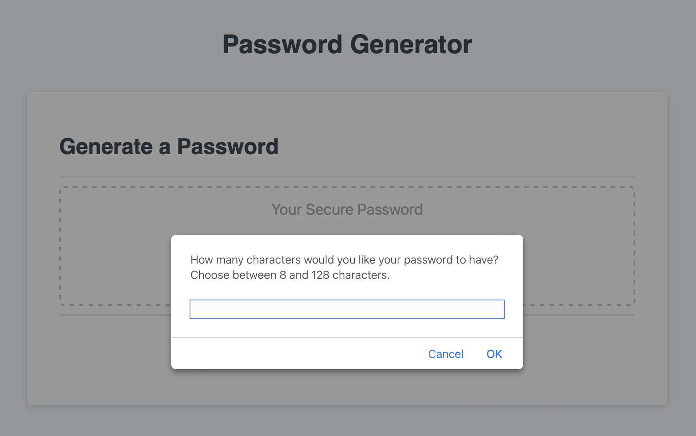
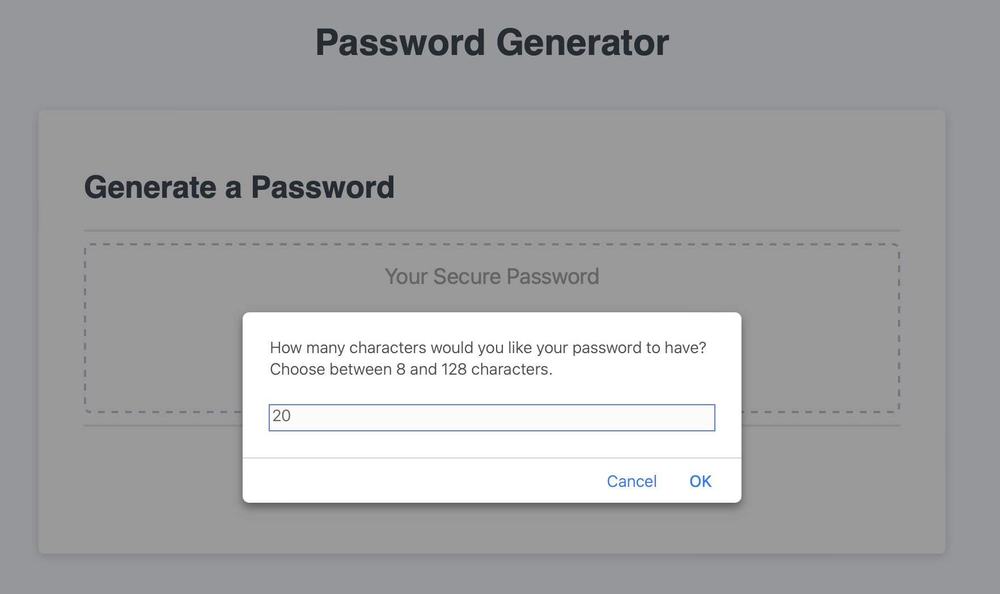
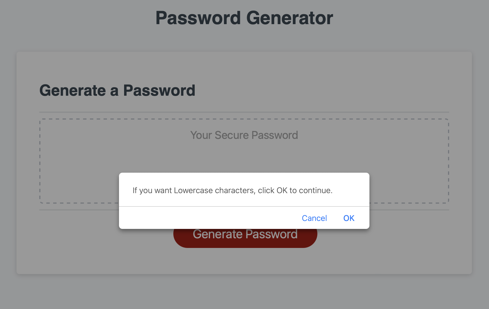
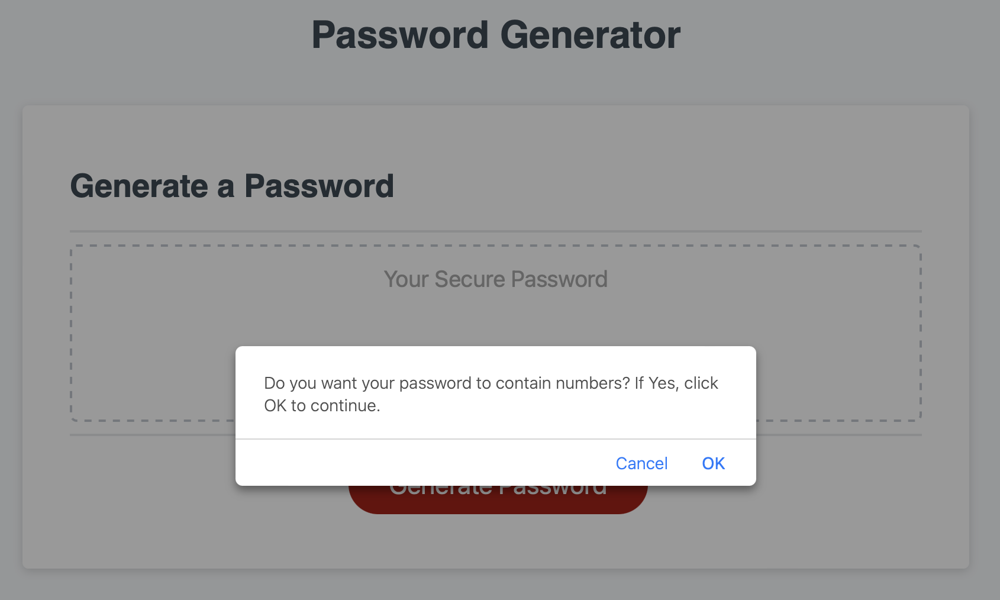
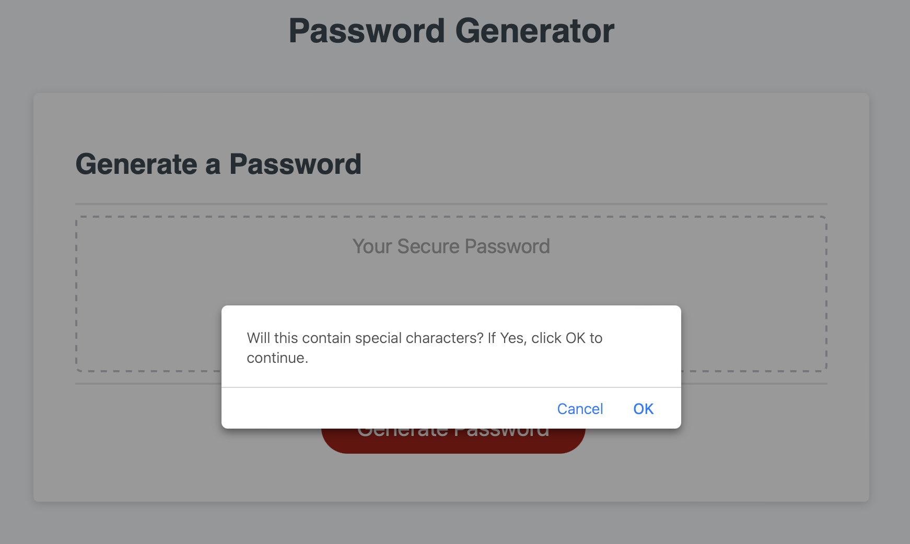
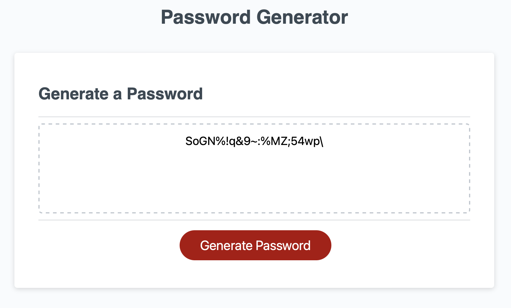

# Password Generator

## Project

This project was developed as part of the module challenge activity.
The proposal is to use JavaScript create a functional password generator, that prompts the user to pick certain criterias to create the new password.

 

## Built With

- HTML
- CSS
- JavaScript

 

## Use

    -   When user clicks the button it will be prompted to specify the following criterias:
        •   Password length;
        •   Yes or No for lowercase characters;
        •   Yes or No for uppercase characters;
        •   Yes or No for numbers;
        •   Yes or No for special characters;

    –   It will then return the password result based on the criteria chosen by the user.

 

## Links

– [Application deployed at live URL](https://rfabreu.github.io/password-generator-ch3/) 
– [GitHub code repository](https://github.com/rfabreu/password-generator-ch3)

  

## Screenshots

 

### PROPOSAL

    

### RESULT

  

## Final considerations

This project was completed as a challenge for the University of Toronto - Coding Boot Camp.
